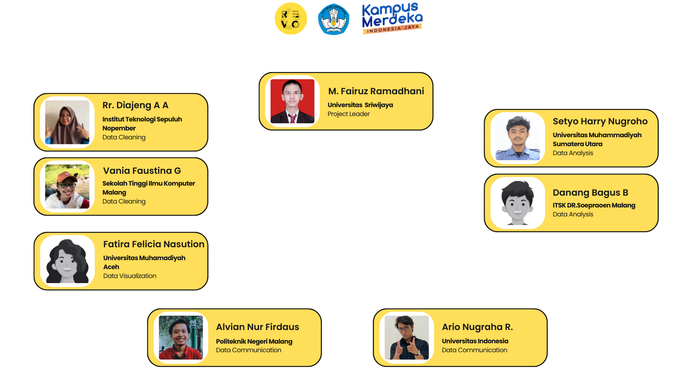
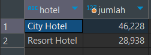

# Capstone-Project-KM-Revou

## Dokumentasi Capstone Project Kampus Merdeka Studi Independen <p> AWS Cloud Data Engineer And Gen AI Track Powered By RevoU

### Berikut adalah anggota tim 9 KM Cendekiawan RevoU
<p>

<br></br>

------

### Data Gathering
Untuk mengumpulkan data yang diperlukan, kami menggunakan dataset pemesanan hotel yang tersedia di Kaggle. Dataset ini berjudul "Hotel Booking Demand" dan disediakan oleh Jesse Mostipak.  Dataset ini mencakup berbagai informasi penting tentang pemesanan hotel, termasuk tanggal pemesanan, negara asal tamu, saluran distribusi yang digunakan, jenis pelanggan, paket pemesanan yang dipilih, dan banyak lagi. Dengan menggunakan dataset ini, kami dapat menganalisis tren historis, mengidentifikasi pola pemesanan, dan memahami preferensi pelanggan secara lebih mendalam.<p>

<br></br>

Berikut link datasetnya : [Hotel Booking Demend](https://www.kaggle.com/datasets/jessemostipak/hotel-booking-demand/data).

---------

### Business Understanding & Problem Definition

**Problem Statement**<p>
Peningkatan tingkat okupansi sebesar 6% pada September 2017

**Busines Question**<p>
- Berapa tingkat pertumbuhan tingkat hunian antara September 2016 dan September 2017?
- Apa saja 5 negara teratas yang mengunjungi city hotel pada bulan September 2016?
- Apa saja 5 saluran distribusi, jenis pelanggan, dan paket pemesanan teratas pada bulan September 2016?

---------

### Data Cleaning & Analysis

1. buat database bernama hotel_bookings, kemudian import data pada  dataset csv ke dalam tabel kedalam database
2. modifikasi table hotel_bookings dengan menambahkan kolom index dengan query sebagai brikut 

    ```sql
    ALTER TABLE hotel_bookings 
    ADD COLUMN `index` INT AUTO_INCREMENT PRIMARY KEY;
    ```
3. lakukan perbandingan  jumlah resort hotel dan city hotel untuk menentukan fokus kita, apakah ingin fokus ke resort hotel ataukah ke city hotel

    ```sql
    select 
	hb.hotel, count(hb.`index`) as jumlah
    from hotel_bookings hb 
    where hb.is_canceled = 0
    group by hb.hotel
    ```
    dihasilkan hasil perbandinganya sebagai berikut 
    ><br></br><p>
    
    Kesimpulan: karena jumlah data di City Hotel lebih banyak daripada data di Resort Hotel, maka kita fokus ke City Hotel

4. Membuat fix table khusus untuk city hotel dan hanya data yang is_cancelled = 0. Disini juga kita buat arrival_date berdasarkan arrival_date_year, arrival_date_month, dan arrival_date_day_of_month

    ```sql
    create table city_hotel_checkin as(
	select 
		hb.`index`, hb.hotel, hb.is_canceled, hb.lead_time, hb.arrival_date_year, hb.arrival_date_month, hb.arrival_date_week_number,
		hb.arrival_date_day_of_month,
		STR_TO_DATE(CONCAT(hb.arrival_date_year, '-', hb.arrival_date_month, '-', hb.arrival_date_day_of_month), '%Y-%M-%d') as arrival_date,
		hb.stays_in_weekend_nights, hb.stays_in_week_nights, hb.adults, hb.children, hb.babies, hb.meal, hb.country,
		hb.market_segment, hb.distribution_channel, hb.is_repeated_guest, hb.previous_cancellations, hb.previous_bookings_not_canceled,
		hb.reserved_room_type, hb.assigned_room_type, hb.booking_changes, hb.deposit_type, hb.agent, hb.company,
		hb.days_in_waiting_list, hb.customer_type, hb.adr, hb.required_car_parking_spaces, hb.total_of_special_requests,
		hb.reservation_status, hb.reservation_status_date
	from hotel_bookings hb
	where hb.hotel = 'City Hotel' and hb.is_canceled = 0
    )
    ```

5. Cek data per tahun untuk mengetahui berapa jumlah data per tahunnya untuk jadi acuan analisis

    ```sql
    select 
        sum(case when chc.arrival_date_year = 2015 then 1 else 0 end) as jumlah_2015,
        sum(case when chc.arrival_date_year = 2016 then 1 else 0 end) as jumlah_2016,
        sum(case when chc.arrival_date_year = 2017 then 1 else 0 end) as jumlah_2017
    from city_hotel_checkin chc
    ```
    dihasilkan seperti berikut
    ><br></br><p>

    Selain itu, kita ingin mengetahui bulan apa saja yang telah terdapat di dataset per tahunnya

    ```sql
    WITH ranked_data AS (
        SELECT 
            chc.arrival_date_month AS bulan, 
            chc.arrival_date_year AS tahun,
            ROW_NUMBER() OVER (PARTITION BY chc.arrival_date_year ORDER BY chc.arrival_date_month) AS row_num
        FROM city_hotel_checkin chc
        GROUP BY chc.arrival_date_month, chc.arrival_date_year
    )
    SELECT 
        MAX(CASE WHEN tahun = 2015 THEN bulan END) AS '2015',
        MAX(CASE WHEN tahun = 2016 THEN bulan END) AS '2016',
        MAX(CASE WHEN tahun = 2017 THEN bulan END) AS '2017'
    FROM ranked_data
    GROUP BY row_num;
    ```
    dihasilkan seperti berikut
    ><br></br><p>

    Kesimpulan: karena data di tahun 2017 hanya mencapai bulan agustus, kita dapat memprediksi kenaikan occupancy rate berdasarkan data september 2016 untuk mendapatkan prediksi occupancy rate untuk september 2017


6. Mengambil banyak arrival per tahun 2016 dan tahun 2017

    >arrival per tahun 2016
    ```sql
    create table arrival_city_2016 as (
    select
        chc.arrival_date, 
        DAYNAME(chc.arrival_date) as hari_arrival,
        count(*) as jumlah_arrival_per_hari
    from city_hotel_checkin chc
    where chc.arrival_date_year = 2016
    group by chc.arrival_date
    )
    ```
    >arrival per tahun 2017
    ```sql
    create table arrival_city_2017 as (
    select
        chc.arrival_date, 
        DAYNAME(chc.arrival_date) as hari_arrival,
        count(*) as jumlah_arrival_per_hari
    from city_hotel_checkin chc
    where chc.arrival_date_year = 2017
    group by chc.arrival_date
    )
    ```

7. Menjalankan script python untuk mendapatkan total banyak orang yang menginap di hotel berdasarkan tanggalnya dan lama menginapnya

    ```python
    def update_tgl(tgl, tanggal, lama_nginap):
    
        if lama_nginap == 0:

            tgl[tanggal] += 1

        else:
            for i in range(lama_nginap):
                tgl_update = tanggal + timedelta(days=i)

                if tgl_update in tgl:
                    tgl[tgl_update] += 1
                else:
                    tgl[tgl_update] = 1

    def get_query_2():
        query_pertama = get_query()

        for x in query_pertama:
            update_tgl(tgl, x['tanggal'], x['lama_nginap'])
    ```
    Dari kode python diatas, function update_tgl akan memperhitungkan per-harinya ada berapa orang yang sedang menginap

8. Menggabungkan hasil tabel arrival_city dengan banyak_orang_city per tahunnya menjadi rekap_city:

    >untuk tahun 2016
    ```sql
    create table rekap_city_2016 as (
    select
        boc.tanggal,
        dayname(boc.tanggal) as hari,
        boc.jumlah as banyak_orang, ac.jumlah_arrival_per_hari as banyak_arrival
    from banyak_orang_city_2016 boc 
    left join arrival_city_2016 ac on ac.arrival_date = boc.tanggal 
    )
    ```
    >untuk tahun 2017
    ```sql
    create table rekap_city_2017 as (
    select
        boc.tanggal,
        dayname(boc.tanggal) as hari,
        boc.jumlah as banyak_orang, ac.jumlah_arrival_per_hari as banyak_arrival
    from banyak_orang_city_2017 boc 
    left join arrival_city_2017 ac on ac.arrival_date = boc.tanggal 
    )
    ```

9. Melihat top 5 countries yang visit city hotel di September 2016 untuk memperkirakan bahwa top 5 countries ini juga akan menginap di September 2017

    ```sql
    select chc.country,
        count(chc.`index`) as jumlah
    from city_hotel_checkin chc 
    where chc.arrival_date_year = 2016 and chc.arrival_date_month = 'September'
    group by chc.country
    order by jumlah desc
    limit 5;
    ```
    dihasilkan seperti berikut
    ><br></br><p>

10. Melihat top 5 distribution channel based on country pada September 2016

    ```sql
    select
        chc.country, chc.distribution_channel,
        count(*) as jumlah
    from city_hotel_checkin chc 
    where chc.arrival_date_year = 2016 and chc.arrival_date_month = 'September'
    group by chc.country, chc.distribution_channel 
    order by jumlah desc
    limit 5;
    ```
    dihasilkan seperti berikut
    ><br></br><p>

11. Melihat top 5 meal based on country and customer type pada September 2016
    ```sql
    select 
        chc.country, chc.customer_type, chc.meal, count(chc.`index`) as jumlah
    from city_hotel_checkin chc 
    where chc.arrival_date_year = 2016 and chc.arrival_date_month = 'September'
    group by chc.country, chc.customer_type, chc.meal
    order by jumlah desc
    limit 5;
    ```

    dihasilkan seperti berikut
    ><br></br><p>

12. Analisis berdasarkan hasil cleaning

    Analisis occupancy rate:
    